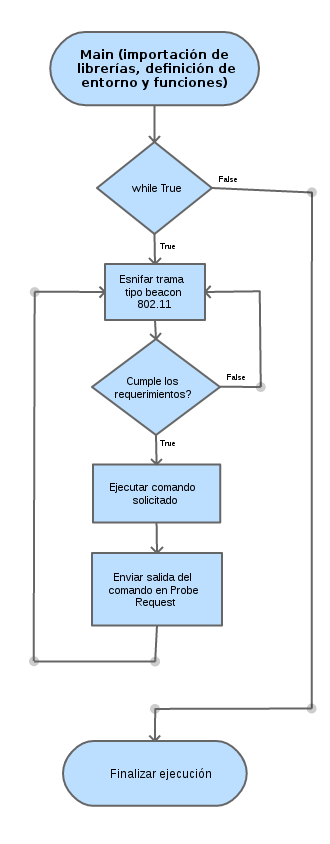

Undetectable Wi-Fi Shell
----------------------------------------------
(Hidding a shell in 802.11 frames using covert channel)

Author: Yago (@yadox) Hansen - 2018

Covert Channel [Wikipedia]: a covert channel is a type of computer security attack that creates 
a capability to transfer information objects between processes that are not supposed to be allowed 
to communicate by the computer security policy.

This script has been programmed using Python and Scapy library for generating a shell on a Linux 
system that will be accessible only through another computer that executes the same scripts. This 
has been achieved by using a secondary channel on Wi-Fi, based on the exchange of encapsulated and 
encrypted 802.11 frames.

Using two Wi-Fi adapters in monitor mode and with injection capabilities, one for the server 
and another for the client, any command can be executed on the server shell just by using the
same script on the client and on the server side. By using a secondary channel, in addition
of data encryption, we protect that shell from any unauthorized access, converting it into a 
very secure and original way to administrate the server wirelessly.

To demonstrate these abilities, this Chat application (using Python Programming language in 
combination with Scapy packet handling library) that creates a kind of covert channel using 
802.11 packets. 

Usage:
------
The usage of this scripts are very simple: 

1. just connect monitor mode Wi-Fi cards that supports traffic injection capabilities 
2. you can use the included "monitor.sh" script to start monitor mode on all wifi cards
3. execute in the server side: python server.py mon0 
4. execute in the client side: python client.py mon0
5. enter "exit" command to exit in the client side (shell>)
6. to restore all the wifi interfaces, run: monitor.sh stop

Troubleshooting:
----------------
* The scripts only work in Linux (tested on Debian and Kali Linux)
* The Wi-Fi cards have to be monitor mode compatible
* The Wi-Fi cards have to support frame injection (not all monitor mode cards support injection)
* Both Wi-Fi cards have to be on the same channel

(spanish/español)

Wi-Fi Shell indetectable
----------------------------------------------
(Ocultando una shell en tramas 802.11 utilizando un canal encubierto)

Estos dos scripts se han programado mediante Python y para generar, como PoC, 
una shell en un sistema Linux que será accesible únicamente mediante otro equipo
que ejecute los mismos scripts. Esto se ha logrado utilizando un canal secundario 
sobre Wi-Fi, basado en el envio de tramas 802.11 encapsuladas y cifradas.

Utilizando dos adaptadores Wi-Fi en modo monitor, una para el servidor y otra para
el cliente podemos ejecutar cualquier comando sobre la shell del servidor mediante
el script en el cliente y ver sus resultados. Al utilizar un canal secundario, además
del cifrado de datos, protegemos esa shell de cualquier acceso no autorizado,
convirtiéndola en una forma muy segura y original para poder gestionar el servidor de
forma inalámbrica.

Instrucciones:
--------------
El uso de estos scripts es muy simple: 

1. Utilizar tarjetas Wi-Fi que soporten modo monitor e inyección
2. Puede utilizar el script incluido: "monitor.sh" para configurar las tarjetas
3. En el lado del servidor: python server.py mon0 
4. En el lado del cliente: python client.py mon0
5. Escriba "exit" en la línea de comando para salir del cliente (shell>)
6. Para restaurar las tarjetas en modo normal ejecute: monitor.sh stop

Troubleshooting:
----------------
* Estos scripts están diseñados para Linux (pobados en Debian y Kali Linux)
* Las tarjetas Wi-Fi deben de soportar modo monitor
* Las tarjetas Wi-Fi deben soportar la inyección de tramas (no todas las tarjetas en modo monitor la soportan)
* Ambas tarjetas Wi-Fi deben estar en el mismo canal
